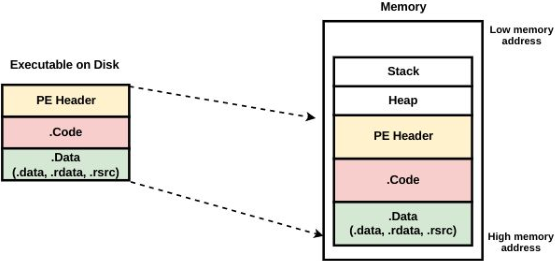
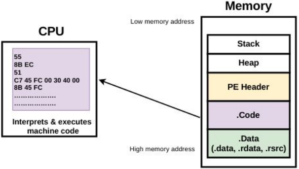
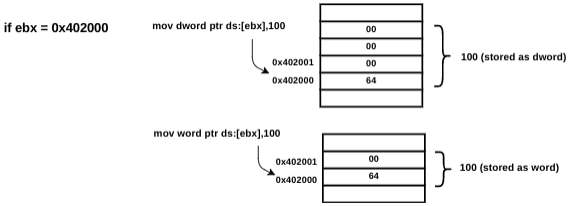

# 04 Assembly Language and Dissasembly Primer

> When analysing a malicious program, you only have it's executable, without it's source code. To gain the understanding of the malware's inner workings and to understand the critical aspects of a malicious binary, code analysis needs to be performed

We will cover the following topics from a code analysis (reverse engineering) perspective.

* Computer basics, memory and the CPU
* Data transfer, arithmetic, and bitwise operations
* Branching and Looping
* Functions and Stack
* Arrays, Strings and Structures
* Concepts of the x64 architecture

## 1. Computer Basics

All information is represented in *bits*.
A bit, can be either a 0 or a 1.
The collection of bits can represent a number, a character, or any other piece of information.

### Fundamental Data Types

8 bits makes a *byte*.
A single byte is represented in two hex digits.
Each hexadecimal digit is made up of 4 bits, and is called a *nibble*.
A *word* is two bytes in size.
A *double word (dword)* is four bytes in size.
A *quadword (qword)* is eight bytes in size.

## 1.1 Memory

* The RAM stores the mahcine code and data of the computer.
* RAM is an array of bytes with eack byte labeled in a unique number, known as it's address.
* The first address starts at 0, and the last is defined by the computer's HW and SW.
* The address and values are represented in hexadecimal.

## 1.1.1 How Data Resides in Memory

* Data is stored in *little-endian* format
* Low-order byte is stored at the lowe address, and subsequent bytes are stored in successively higher addresses in the memory

## 1.2 CPU

* CPU executes instructions (Stored in memory, as a sequence of bytes)
* While executing the instructions, the required data is fetched from memory
* CPU contains a register set, wich stores values fetched from memory during execution

## 1.2.1 Machine Language

* Each CPU has a set of instructions that it can execute (These make up the CPU's Machine Language)
* A compiler translates a program (like C or C++) into machine language

## 1.3 Program Basics

## Program Compilation

1. Source code is written in a high level language
1. Source code is run through a compiler
1. Object code is passed through a linker, wich links the object code with it's required libraries

## 1.3.2 Program On Disk

When a program is compiled, it generates a `.exe` file, wich, if viewed by *pe-internals* displays the 5 sections generated by the compiler (`.text, .rdata, .data, .rsrc, .reloc`) 

* In `.data`, we store the data, used by our program 
* In `.rdata`, we store read-only data and sometimes, import-export information
* In `.rsrc`, we store resources used by the executable
* In `.text`, we store the machine code (Our program translated to machine code by the compiler) 

## 1.3.3 Program in Memory

When the executable is double-clicked a process memory is allocated by the operating system, and the executable is loaded into the allocated memory by the operation system loader.

Once the executable that contains the code is loaded into the memory, the CPU fetches the machine code from memory, interprets it, and executes it. 
While executing the machine instructions, the required data will also be fetched from memory.

## 1.3.4 Program Dissasembly (From Machine code To Assembly code)

A *dissasembler/debugger* is a program that translates machine code into a low-level code called *assambly* wich can be read and analysed to determine the workings of a program.

## 2. CPU Registers

CPU can access data in registers much faster than data in Memory, this is why the values stored in memory are stored in these registers to perform operations

## 2.1 General Purpose Registers

* The x86 CPU has 8 general purpose registers:
    * `eax, ebx, ecx, edx, esp, ebp, esi, edi` 
* These registers are 32 bits (4 bytes) in size.
* A program can access registers as 32-bits, 16-bits or 8-bits
* The lower 16 bits of each of these registers can be accessed as `ax, bx, cx, dx, sp, bp, si, di`
* The lower 8 bits of `eax, ebx, ecx, edx` can be referenced as `al, bl, cl, dl`
* The higher 8 bits can be accessed as `ah, bh, ch, dh`

As an example:

> The `eax` register contains the 4-byte value `0xC6A93174`
A program can access the lower 2 bytes (`0x3174`) by accessiong register `ax`
It can access the lower byte (`0x74`) by accessing register `al`
and the next byte (`0x31`) can be accessed using register `ah`

## 2.2 Instruction Pointer (EIP)

The CPU has a special register called the `eip`; it contains the address of the next instruction to execute. 
When the instruction is executed, the `eip` will point to the next instruction in the memory.

## 2.3 EFLAGS Register

The `eflags` register is a 32-bit register, each bit in this register is a flag.
There are also additional registers called *segment registers* (`cs, ss, ds, es, fs, gs`) which keep track of sections in the memory.

## 3. Data Transfer Instructions

The `mov` instruction is one of the basic instructions in the assambly language. 
It moves data from one location to another.

> `mov dst,src`

There are also different variations of the `mov` instruction

## 3.1 Moving a constant into register

A variation of the `mov` command.
Moves a constant or a immediate value into a register.

> `mov eax,10 ; moves 10 into EAX register, same as eax=10`

## 3.2 Moving Values From Register to Register

Done by placing the manes of the registers in the operands

> `mov eax,ebx ; moves content of ebx into eax`

## 3.3 Moving values from Memory to Registers

1. An integer is 4 bytes in length, so the integer 100 is stored as a sequence of 4 bytes (`00 00 00 64`) in the memory.
1. The sequence of 4 bytes is stored in *little-endian* format
1. The integer 100 is stored at some memory address.

To move a value from the memory into a register in the assambly language, you must use the address of the value.
The dest (`eax`) will automatically determine how many bytes to move.

`mov eax,[0x403000] ; eax will now contain 00 00 00 64 (i.e 100)`

The square brackets may contain a *register*, a *constant added to a register*, or a *register added to a register*.

Another common instruction is the `lea` instruction.
This stands for *Loat Effective Address*.
This instruction will load the address instead of the value

> `lea ebx,[0x403000] ; loads the address 0x403000 into ebx`
> `lea eax,[ebx] ; if ebx = 0x403000, then eax will also contain 0x403000`

## Moving Values From Registers To Memory

Swapping the operands, you can move a value from a register to memory

> `mov [0x403000],eax ; moves 4 byte value in eax to memory location starting at 0x403000`

> `mov [ebx],eax ; moves 4 byte value in eax to the memory address specified by ebx`

`dword ptr` just specifies that a `dword` value (4 bytes) is moved into the memory location.

> `mov dword ptr [402000],13498h ; moves dword value 0x13496 into the address 0x402000`

> `mov dword ptr [ebx],100 ; moves dword value 100 into the address specified by ebx`

> `mov word ptr [ebx],100 ; moves a word 100 into the address specified by ebx`

In the preceding case, if `ebx` contained the memory address `0x402000`, then the second instruction copies `100` as `00 00 00 64` (4 bytes) and the third instruction copies `100` as `00 64` (2 bytes) into the memory location starting at `0x402000`, as shown below:

## 4. Arithmetic Operations

You can perform addition, subtraction, multiplication and division in assambly language.
Addition adds src + dest and stores it id dest.
Same with Subtraction.
These instructions set or clear flags in the `eflags` register.
These flags can be used in conditional statements.
The `sub` instruction sets the zero flag `(zf)` if the result is zero, and the carrt flag `(cf)` if the destination value is less than the source. 

> `add eax,42 ; same as eax = eax+42` 

> `add eax, ebx ; same as eax = eax+ebx` 

> `add [ebx],42 ; adds 42 to the value in the address specified by ebx` 

> `sub eax, 64h ; subtracts hex value 0x64 from eax, same as eax = eax-0x64` 

There are special increments `(inc)` and decrements `(dec)` instructions. 
These add 1 or subtract 1 from either a register or a memory location.

> `inc eax ; same as eax = eax + 1`

> `dec eax ; same as eax = eax - 1` 

Multiplication is done with the `(mul)` instruction.
This instruction takes only one operand; wich is multiplied by the content of the `al, ax, eax` register.
The result of the multiplication is stored in either `ax, dx, edx, eax` registers.
If the operand of the `mul` instruction is *8 bits (1 byte)*, then it is multiplied by the 8-bit `al` register, and the product is stored in the `ax` register.
If the operand is *16 bits (2 bytes)*, then it is multiplied with the `ax` register, and the product is stored in the `dx` and `ax` register.
If the operand is *32 bit (4 bytes)*, then it is multiplied with the `eax` register, and the product is stored in the `edx` and `eax` register. 

> `mul ebx ; ebx is multiplied with eax and the result is stored in EDX and EAX` 

> `mul bx ; bx is multiplied with ax and the result is stored in DX and AX`

Division is performed using the `div` instruction.
The `div` takes only one operand, wich is either a register or a memory reference.
To perform division, you place the dividend (number to divide) in the `edx` and `eax` registers, with `edx` holding the most significant *dword*.
After the `div` instruction is executed, the quotient is stored in `eax`, and the remainder is stored in the `edx` register:

> `div ebx ; divides the vaule in EDX:EAX by EBX`

## 5. Bitwise operations

