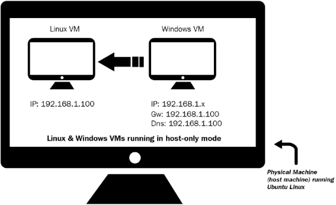

# Dynamic analysis

It involves analyzing a sample by executing it in an isolated environment and monitoring its activities, interaction, and effect on the system.

## 1. Lab Environment Overview

Configure a safe production environment, to prevent virus from infecting your machine.

## 2. System and Network Monitoring

The objective is to gather real-time data related to malware behavior and its impact on the system. 
There are different types of monitoring:

* **Process monitoring:** Monitoring the process activity and examining the properties of the result process
* **File system monitoring:** Monitoring the real-time filesystem activity during malware execution.
* **Registry monitoring:** Involves monitoring the registry keys accessed/modified and the registry data that is being read/written by the malicious binary
* **Network monitoring:** Involves monitoring the live traffic to and from the system during malware execution.

## 3. Dynamic Analysis (Monitoring) Tools

## 3.1 Process Inspection with Process Hacker

> Open Source, multi-purpose tool that helps in monitoring system resources.

Once the malware has executed, this tool can help identify the newly created malware process.

## 3.2 Determining System Interaction With Process Monitor

> Advanced monitoring tool that shows the real time interaction of the processes with the filesystem, registry, and process/thread activity.

When executed as Admin, this tool shows all the system's processes, you can filter (`Ctrl + L`), pause(`Ctrl + E`) and clear (`Ctrl + X`) events.

## 3.3 Logging System Activities Using Noriben

> Noriben is a Python script that works in conjunction with Process Monitor and helps in collecting, analyzing and reporting runtime indicators of the malware.

To use Noriben, download it and copy the `Procmon.exe` file into de Noriben folder.
Open Noriben, and this will automatically open the Process Monitor.
Once you are finished, exit the process monitor. 
Results will be logged to a text and a CSV file.

## 3.4 Capturing Network Traffic with Wireshark

Use Wireshark to capture network traffic.
To start capturing: `Capture > Options (or Ctrl + k) > select network interface > Start`

## 3.5 Simulating Network Services with INetSim

Most malware connect to their Command and Control servers when executed.
To prevent this and analyze the malware, we need to mock the server.

Apart from simulating services, INetSim can log communications, and it can also be configured to respond to HTTP/HTTPS requests and return any file based on the extension.

If for example, a malware wants to communicate with it's CC server and INetSim isn't available, the request will produce a DNS error, because it doesn't know how to translate the address.
With INetSim, the traffic is translated into the computer's own IP address.
This way, we can see what the malware intends to do, and respond to it.

## 4. Dynamic Analysis Steps

Steps to determine the functionality of the malware.

* **Reverting to the clean snapshot:** Reverting VM to the clean snapshot
* **Running the monitoring/dynamic analysis tools:** Run the tools before the specimen
* **Executing the malware specimen:** Run malware sample with administrator privileges
* **Stopping the monitoring tools:** Stop the tools once the malware has executed for a given time
* **Analyzing the results:** Collecting the data/reports from the monitoring tools and analyzing them to determine the malware's behavior and functionality.

## 5. Putting it all Together: Analyzing a Malware Executable

Example use of static and dynamic analysis on sample `sales.exe`.

## 5.1 Static Analysis of the sample

1. Determine the file type.
    * `file sales.exe`
1. Determine the cryptographic hash.
    * `md5sum sales.exe`
1. Extract the ASCII strings from the binary
    * `strings sales.exe > strings.txt`
    * In this specific example, the strings command references the `RUN` registry key. This means it has the ability of starting itself again, once the computer restarts.
    * It also shows `WinExec` and `ShellExecuteA` API calls, this means it can invoke other programs or create new processes.
1. Query the hash value with antivirus detection sites, like *VirusTotal*.
    * In this specific instance, ours matches a malware called *poisonIvy*

## Dynamic Analysis of the sample

1. Revert both server and infected machines to clean snapshots
1. Start *Noriben* with *ProcessHacker* on the Windows (infected) machine
1. Start *INetSim* on the server (Linux) machine
1. Start *Wireshark* on the server (Linux) machine
1. Execute the malware as superuser on Windows, for a given period of time
1. Stop *Noriben* after stopping the executable on Windows
1. Stop *INetSim* after stopping the executable on Linux
1. Stop *Wireshark* after stopping the executable on Linux

Now, we have all the logs and registry we need to further analyse the malware.

1. Check which new processes have been created after the execution
1. Check the network packets sent and received by the malicious program

# 6. Dynamic-Link Library (DLL) Analysis

