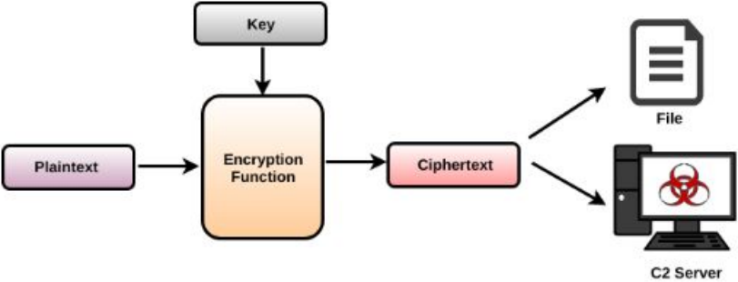
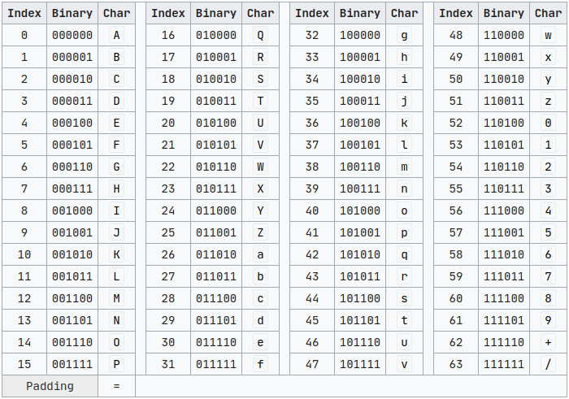

# Malware Obfuscation Techniques

* *obfuscation*: the process of obscuring meaningful information.

In addition to obfuscation, attackers also use encoding/encryption techniques, which makes reversing much more difficult.

Reasons for encoding and encrypting:

* Conceal command and control communication
* Hide from signature-based solutions, such as IPS
* Obscure the content of the configuration file used by the malware
* Encrypt information to be exfiltrated from the victim system
* Obfuscate strings, to hide from static analysis

Definitions:

* *Plaintext:* Unencrypted message
* *Cyphertext:* Encrypted message

Malware encrypts the *plaintext*, by passing it as input along with the *key* to an encryption function, which produces a *cyphertext*.
The resulting *cyphertext* is then used to write to file or send over the network.



Malware may receive an encrypted content from the C2 server and then decrypt it by passing the encrypted content and the key to the decryption function.

To understand how a particular content is encrypted or decrypted, you will mainly focus on identifying the encryption or decryption functions and the key used to encrypt or decrypt the content.

## 1. Simple Encoding

Most of the time, attackers use very simple encoding, such as `Base64 encoding` or `xor encryption` to obscure the data.
This is because they use very little system resources and are just enough to obscure the content from the security products and the security analyst.

## 1.1 Caesar Cypher

Also known as shift-cypher.
Encodes the message by shifting each letter in the plain text with some fixed number of positions down the alphabet.

The following diagram shows the character set, the encryption, and the decryption of the text "`ZEUS`" using `3` as the key.


## 1.1.2 Decryption of Caesar Cypher in Python

```Python
chr_set = "ABCDEFGHIJKLMNOPQRSTUVWXYZ"
key = 3
cypher_text = "CHXV"
plain_text = ""
for ch in cypher_text:
    j = chr_set.find(ch.upper())
    plain_index = (j - key) % len(chr_set)
    plain_text += chr_set[plain_index]
print plain_text
```

## 1.2 Base64 Encoding

Unlike Caesar cypher, Base64 **can** encode binary data.
It allows an attacker to encode binary data to an ASCII string format.

## 1.2.1 Translating data to Base64

Standard Base64 encoding consists of the following 64-character set.
Each 3 bytes (24 bits) of the binary data that you want to encode is translated into four characters from the character set mentioned above.
Each translated character is 6 bits in size.
In addition to the following characters, the = character is used for padding.



If we want to encode text `One`, we need to convert the letters to their corresponding bit values:

> `O -> 0x4f -> 01001111`
`n -> 0x6e -> 01101110`
`e -> 0x65 -> 01100101`

The Base64 algorithm processes 3 bytes at a time;
In this case, we have exactly `24` bits that are placed next to each other:

> `010011110110111001100101`

The `24` bits are then split in four parts, each consisting of `6` bits and converted to its equivalent decimal value.
The decimal value is then used as an index to find the corresponding value in the `Base64` index table, so the text `One` encodes to `T251`:

> `010011 -> 19 -> Base64 table lookup -> T`
`110110 -> 54 -> Base64 table lookup -> 2`
`111001 -> 57 -> Base64 table lookup -> 5`
`100101 -> 37 -> Base64 table lookup -> 1`

## 1.2.2 Encoding and Decoding Base64

In Python:

```Python
# Encode text in Base64

import base64
plain_text = "One"
encoded = base64.b64encode(plain_text)
print encoded

# Decode text in Base64 

import base64
encoded = "T251"
decoded = base64.b64encode(encoded)
print decoded
```

## 1.2.3 Decoding Custom Base64

Some malware samples delete the padding character `=` from the end.
When decoding the encoded string, there will be a `Padding error`.
Upon inspection, it is clear that the `len(encoded_string)` is not a multiple of 4.
To obtain the encoded string, add back the `=` characters to make it a multiple of 4 again.

Sometimes, characters are replaced.
For example, `+ /` characters are replaced with `- _` characters.
Replace the characters in the encoded string and decode to obtain the decoded text.

Sometimes, the authors reorder the character in the character set.
To decode this:

```Python
import base64
chr_set = "ABCDEFGHIJKLMNOPQRSTUVWXYZabcdefghijklmnopqrstuvwxyz0123456789+/="
non_chr_set = "0123456789+/ABCDEFGHIJKLMNOPQRSTUVWXYZabcdefghijklmnopqrstuvwxyz="
encoded = "G6JgP6w="
re_encoded = ""
for en_ch in encoded:
    re_encoded += en_ch.replace(en_ch, chr_set[non_chr_set.find(en_ch)])
decoded = base64.b64encode(re_encoded)
print decoded
```

## 1.2.4 Identifying Base64 

You can identify a binary using Base64 encoding by looking for a long string comprising the Base64 character set.

Using `IDA PRO` *string cross-reference* feature, you can land at the place the string is used.
In the case the malware authors encrypt the C2 network traffic with other encryption algorithms, and then uses `Base64` encoding, looking at the `Base64` character set, will probably land you at the `Base64` function. 
Further analysis of the function, may help you identify the functions that call the `Base64` function.This will probably land you at the encryption function.

Another method of detecting the presence of the `Base64` character set is using a YARA rule.

## 1.3 XOR Encoding

Bitwise operation performed on the corresponding bits of the operands.


## 1.3.1 Single Byte XOR

Each byte from the plaintext is `XORed` with the encryption key.

Encrypting `cat` with a key of `0x40`, then, each character from the text is `XORed` with `0x40`, which results in the cipher-text `#!4`.


When you XOR the cypher text with the same `XOR` key, you get back the plain text.


## 1.3.2 Finding XOR Key Through Brute-Force

In a single byte `XOR`, the length of the key is one byte, so there are only `255` possible keys (`0x0 - 0xff` with the exception of `0` as the `key` because `XORing` any value with `0` will give the same value as output.

This technique is useful when you know what to find in the decrypted data.
The following example shows a `brute-force` expecting `mymachine` as output. 

```Python
def xor_brute-force(content, to_match):
    for key in range(256):
        translated = ""
        for ch in content:
            translated += chr(ord(ch) ^ key)
        if to_match in translated:
            print "Key %s(0x%x): %s" % (key, jey, translated)

xor_brute-force("lkwpjeia>i}ieglmja", "mymachine")

key 4(0x4): hostname:mymachine
```

## 1.3.3 NULL Ignoring XOR Encoding

In `XOR` encoding, when a null byte `(0x00)` is `XORed` with a key, you get back the key as shown here:

> `ch = 0x00`

> `key = 4`

> `ch ^ key`

> `4`

You can use this to find the key if there is a buffer with a large number of null bytes encoded.
This property makes it easy to spot the key if the null bytes are not ignored.
To avoid the null byte problem, malware authors ignore the null byte.

## 1.3.4 Multi-byte XOR Encoding

More common among attackers because it provides better defense against brute-force technique.
An attacker can encrypt a PE file with a 4-bit `XOR` key and decrypt at compile time.

## 1.3.5 Identifying XOR Encoding

Load the binary in IDA and search for the `XOR` instruction.
It is very common to see `XOR` operations where the operands are the same memory register.
This is used by the compiler to zero out register values.
To identify `XOR` encoding, look for:

* `XOR` of a register (or memory reference) with a constant value:
    * `XOR esi 0EAD4AA34h`
* `XOR` of a register with a different register (or memory reference)
    * `XOR esi edi`

Some programs used to determine the `XOR` key:

* *CyberChef* 
* *XORSearch by Didier Stevens* 
* *Balbuzard* 
* *unXOR* 
* *rrxor.py* 
* *NoMoreXOR.py* 
