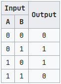
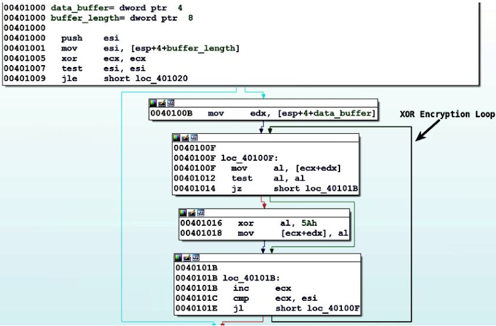
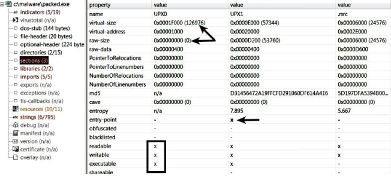

# Malware Obfuscation Techniques

* *obfuscation*: the process of obscuring meaningful information.

In addition to obfuscation, attackers also use encoding/encryption techniques, which makes reversing much more difficult.

Reasons for encoding and encrypting:

* Conceal command and control communication
* Hide from signature-based solutions, such as IPS
* Obscure the content of the configuration file used by the malware
* Encrypt information to be exfiltrated from the victim system
* Obfuscate strings, to hide from static analysis

Definitions:

* *Plaintext:* Unencrypted message
* *Cyphertext:* Encrypted message

Malware encrypts the *plaintext*, by passing it as input along with the *key* to an encryption function, which produces a *cyphertext*.
The resulting *cyphertext* is then used to write to file or send over the network.


Malware may receive an encrypted content from the C2 server and then decrypt it by passing the encrypted content and the key to the decryption function.

To understand how a particular content is encrypted or decrypted, you will mainly focus on identifying the encryption or decryption functions and the key used to encrypt or decrypt the content.

## 1. Simple Encoding

Most of the time, attackers use very simple encoding, such as `Base64 encoding` or `xor encryption` to obscure the data.
This is because they use very little system resources and are just enough to obscure the content from the security products and the security analyst.

## 1.1 Caesar Cypher

Also known as shift-cypher.
Encodes the message by shifting each letter in the plain text with some fixed number of positions down the alphabet.

The following diagram shows the character set, the encryption, and the decryption of the text "`ZEUS`" using `3` as the key.


## 1.1.2 Decryption of Caesar Cypher in Python

```Python
chr_set = "ABCDEFGHIJKLMNOPQRSTUVWXYZ"
key = 3
cypher_text = "CHXV"
plain_text = ""
for ch in cypher_text:
    j = chr_set.find(ch.upper())
    plain_index = (j - key) % len(chr_set)
    plain_text += chr_set[plain_index]
print plain_text
```

## 1.2 Base64 Encoding

Unlike Caesar cypher, Base64 **can** encode binary data.
It allows an attacker to encode binary data to an ASCII string format.

## 1.2.1 Translating data to Base64

Standard Base64 encoding consists of the following 64-character set.
Each 3 bytes (24 bits) of the binary data that you want to encode is translated into four characters from the character set mentioned above.
Each translated character is 6 bits in size.
In addition to the following characters, the = character is used for padding.


If we want to encode text `One`, we need to convert the letters to their corresponding bit values:

> `O -> 0x4f -> 01001111`
`n -> 0x6e -> 01101110`
`e -> 0x65 -> 01100101`

The Base64 algorithm processes 3 bytes at a time;
In this case, we have exactly `24` bits that are placed next to each other:

> `010011110110111001100101`

The `24` bits are then split in four parts, each consisting of `6` bits and converted to its equivalent decimal value.
The decimal value is then used as an index to find the corresponding value in the `Base64` index table, so the text `One` encodes to `T251`:

> `010011 -> 19 -> Base64 table lookup -> T`
`110110 -> 54 -> Base64 table lookup -> 2`
`111001 -> 57 -> Base64 table lookup -> 5`
`100101 -> 37 -> Base64 table lookup -> 1`

## 1.2.2 Encoding and Decoding Base64

In Python:

```Python
# Encode text in Base64

import base64
plain_text = "One"
encoded = base64.b64encode(plain_text)
print encoded

# Decode text in Base64 

import base64
encoded = "T251"
decoded = base64.b64encode(encoded)
print decoded
```

## 1.2.3 Decoding Custom Base64

Some malware samples delete the padding character `=` from the end.
When decoding the encoded string, there will be a `Padding error`.
Upon inspection, it is clear that the `len(encoded_string)` is not a multiple of 4.
To obtain the encoded string, add back the `=` characters to make it a multiple of 4 again.

Sometimes, characters are replaced.
For example, `+ /` characters are replaced with `- _` characters.
Replace the characters in the encoded string and decode to obtain the decoded text.

Sometimes, the authors reorder the character in the character set.
To decode this:

```Python
import base64
chr_set = "ABCDEFGHIJKLMNOPQRSTUVWXYZabcdefghijklmnopqrstuvwxyz0123456789+/="
non_chr_set = "0123456789+/ABCDEFGHIJKLMNOPQRSTUVWXYZabcdefghijklmnopqrstuvwxyz="
encoded = "G6JgP6w="
re_encoded = ""
for en_ch in encoded:
    re_encoded += en_ch.replace(en_ch, chr_set[non_chr_set.find(en_ch)])
decoded = base64.b64encode(re_encoded)
print decoded
```

## 1.2.4 Identifying Base64 

You can identify a binary using Base64 encoding by looking for a long string comprising the Base64 character set.

Using `IDA PRO` *string cross-reference* feature, you can land at the place the string is used.
In the case the malware authors encrypt the C2 network traffic with other encryption algorithms, and then uses `Base64` encoding, looking at the `Base64` character set, will probably land you at the `Base64` function. 
Further analysis of the function, may help you identify the functions that call the `Base64` function.This will probably land you at the encryption function.

Another method of detecting the presence of the `Base64` character set is using a YARA rule.

## 1.3 XOR Encoding

Bitwise operation performed on the corresponding bits of the operands.



## 1.3.1 Single Byte XOR

Each byte from the plaintext is `XORed` with the encryption key.

Encrypting `cat` with a key of `0x40`, then, each character from the text is `XORed` with `0x40`, which results in the cipher-text `#!4`.


When you XOR the cypher text with the same `XOR` key, you get back the plain text.



## 1.3.2 Finding XOR Key Through Brute-Force

In a single byte `XOR`, the length of the key is one byte, so there are only `255` possible keys (`0x0 - 0xff` with the exception of `0` as the `key` because `XORing` any value with `0` will give the same value as output.

This technique is useful when you know what to find in the decrypted data.
The following example shows a `brute-force` expecting `mymachine` as output. 

```Python
def xor_brute-force(content, to_match):
    for key in range(256):
        translated = ""
        for ch in content:
            translated += chr(ord(ch) ^ key)
        if to_match in translated:
            print "Key %s(0x%x): %s" % (key, jey, translated)

xor_brute-force("lkwpjeia>i}ieglmja", "mymachine")

key 4(0x4): hostname:mymachine
```

## 1.3.3 NULL Ignoring XOR Encoding

In `XOR` encoding, when a null byte `(0x00)` is `XORed` with a key, you get back the key as shown here:

> `ch = 0x00`

> `key = 4`

> `ch ^ key`

> `4`

You can use this to find the key if there is a buffer with a large number of null bytes encoded.
This property makes it easy to spot the key if the null bytes are not ignored.
To avoid the null byte problem, malware authors ignore the null byte.

## 1.3.4 Multi-byte XOR Encoding

More common among attackers because it provides better defense against brute-force technique.
An attacker can encrypt a PE file with a 4-bit `XOR` key and decrypt at compile time.

## 1.3.5 Identifying XOR Encoding

Load the binary in IDA and search for the `XOR` instruction.
It is very common to see `XOR` operations where the operands are the same memory register.
This is used by the compiler to zero out register values.
To identify `XOR` encoding, look for:

* `XOR` of a register (or memory reference) with a constant value:
    * `XOR esi 0EAD4AA34h`
* `XOR` of a register with a different register (or memory reference)
    * `XOR esi edi`

Some programs used to determine the `XOR` key:

* *CyberChef* 
* *XORSearch by Didier Stevens* 
* *Balbuzard* 
* *unXOR* 
* *rrxor.py* 
* *NoMoreXOR.py* 

# 2. Malware Encryption 

To identify the use of cryptographic functionality in the binary, you can look for cryptographic indicators (Signatures) such as:

* Strings or imports that reference cryptographic functions
* Cryptographic constants
* Unique sequences of instructions used by cryptographic routines

## 2.1 Identifying Crypto Signatures Using Signsrch

This tool relies on cryptographic signatures to detect encryption algorithms.
The cryptographic signatures are located in a text file: `signsrch.sig`.

When `Signsrch` is run with the `-e` option, it displays the relative virtual to the PE header address where the `DES` signatures were detected in the binary.

You can now use IDA to go to that address.
To further investigate, use the cross references feature to show that `DES_ip` is referenced within a function.
Going to that address, will most likely land you inside the encryption function.

When `Signsrch` is run with the `-F` option, it will give you the address relative to the PE header of the first instruction where the crypto indicator is used.

When `Signsrch` is run with the `-P` option, it will locate the address of the Crypto indicator in a running process.

When `Signsrch` is run with the `-p` option, it automatically determines the base address where the executable is loaded, and then calculates the virtual address of the crypto signatures.

## 2.2 Detecting Crypto Constants Using FindCrypt2

> FindCrypt2 is a IDA Pro plug-in that searches for cryptographic constants used by many different algorithms in memory.

The plug-in is automatically run when opening a binary.
The results are displayed in the output window.

## 2.3 Detecting Crypto Constants Using YARA

You can download the YARA rules created by other security researchers, and then scan the binary with the YARA rules.

*x64dbg* integrates YARA;
You can load the binary into *x64dbg* and right-click on the CPU window and select YARA;
This will bring up a YARA dialog.
You can right-click on any of the entries and select *Follow in Dump* to look at the data in the dump window, or double-click on the entry to navigate to the code.

## 2.4 Decrypting in Python

After identifying the encryption algorithm and the key used to encrypt the data, you can decrypt the data using the *PyCryto* Python module.

To decrypt the content, import the appropriate encryption module from `Crypto.Cipher`.

```Python
from Crypto.Cipher import DES
text = "hostname=blank78"
key = "14834567"
des = DES.new(key, DES.MODE_ECB)
cipher_text = des.encrypt(text)

plain_text = des.decrypt(cipher_text)
```

# 3. Custom Encoding/Encryption

One of the custom encoding methods is to use a combination of encoding and encryption to obfuscate the data; 
An example of such a malware is *Etumbot*
This malware obtains the `RC4` key from the C2 server;
It then uses the obtained `RC4` key to encrypt the system information and the encrypted content is further encoded using custom `Base64` and exfiltrated to the C2.


To deobfuscate the content, it needs to be decoded using custom `Base64` first and then decrypted using `RC4`;

```Python
import base64
from Crypto.Cipher import ARC4

rc4_key = "e65wb24n5"
cipher_text = "kRp6OKW9r90_2_KvkKcQ_j5oA1D2aIxt6xPeFiJYlEHvM8QMql38CtWfWuYlgiXMDFlsoFoH"
content = cipher_text.replace('_', '/').replace('-', '=')
b64_decode = base64.b64decode(content)
rc4 = ARC4.new(rc4_key)
plain_text = rc4.decrypt(b64_decode)
print(plain_text)
# MYHOSTNAME|Administrator|192.168.1.100|No Proxy|04182|
```

Instead of using a combination of standard encoding/encryption algorithms, some malware authors implement a completely new encoding/encryption scheme.

We can write a decryption script that analyzes whenever the decryption algorithm is called, and passes all the parameters passed to it, so we end up having decrypted every parameter that has been passed to the decryption algorithm in execution time, in one script.

# 4. Malware Unpacking

To make sense of a packed binary, you need to remove the obfuscation layer (unpack) applied to the program.
When the packed binary is executed, the unpacking stub extracts the original binary (during runtime) and then triggers the execution of the original binary by transferring control to the original entry point (OEP)


## 4.1 Manual Unpacking

1. Identify the OEP
1. Execute the program until the OEP is reached
1. Dump the unpacked process from memory to disk
1. Fix the IAT (Import Address Table) of the dumped file

## 4.1.1 Identifying the OEP

In this example, examining the binary packed with [UPX packer](https://ups.github.io/) with *[pestudio](https://www.winitor.com/)* will show many indicators that the file is packed:



* The entry point is in `UPX1`
* The virtual and raw size of `UPX0` differ a lot
* The IAT is at a non-standard location

To find the OEP, you will need to locate the instruction in the packed program that transfers control to the OEP.

Inspecting with IDA, we can see the address destination in unclear when it is highlighted in red.
Double-clicking on the *jump destination* `(byte_40259B)` shows that the jump will be taken up to `UPX0` from `UPX1`.

Once we have located the instruction that jumps to the OEP, we load the binary with a debugger and set a breakpoint at the instruction performing the jump and execute until it reaches that instruction.

We can now assume the malware has finished unpacking.
Pressing *F7* once (Stepping into) will take us to the original entry point.
At this point, we are at the malware's first instruction.

## 4.1.2 Dumping Process Memory With [Scylla](https://github.com/NtQuery/Scylla)

Scylla is a tool to dump the process memory and to rebuild the import address table.
To dump the process memory with x64dbg, while the executable is paused at the OEP, launch Scylla, make sure the OEP is at the correct address, and click on the Dump button and save the dumped executable to disk.

Now the binary is uncompressed and IDA will be able to see the entire list of built-in functions, but the imports are not visible, and the API calls display addresses instead of names.

## 4.1.3 Fixing the Import Table

To fix, go back to Scylla and click on the IAT Autosearch  button.
This will scan the memory of the process to locate the import table.
To get the list of imports, click on the Get Imports button.

Now, we haver to apply the patch to the dumped executable.
Click on the Fix dump button, and select the file we dumped before.
A new file, containing `_SCY` at the end will be generated.
This will contain the uncompressed binary and the fixed Imports table.

## 4.2 Automated Unpacking

Great for known packers, not so much for others. 
It is preferable to unpack by hand.

### TitanMist 

TitanMist is a great tool that consists of various packer signatures and unpacking scripts.

`TitanMist.exe -i packed.exe -o unpacked.exe -t python`

Will automatically identify the packer and perform the unpacking process, detecting the OEP and the import table, dumping the process, fixing the imports, and applies the patch to the dumped process.

### IDA Pro's Universal PE Unpacker plugin

This plugin executes the malware and tries to suspend the process as soon as the malware finishes unpacking.
After this, the plugin will prompt saying it has detected the OEP. 
If you click yes, the execution is stopped and the process is exited, but before that, IDA automatically determines the IAT and it creates a new segment to rebuild the import section of the program.
If you click no, IDA will pause the debugger at the OEP, and you can manually dump the executable.

### x64dbg automated unpacking scripts

Make sure the binary is loaded and pause at the entry point.
After loading the script, right-click on it's pane and select Run.
If the script finishes successfully, a message box will alert you it has finished.
From here, you can use Scylla to dump the unpacked binary to disk.
