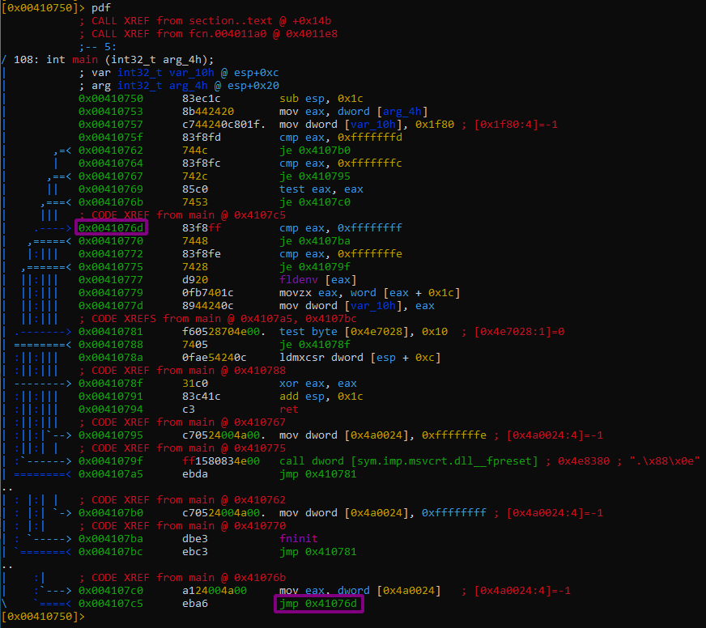
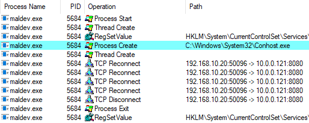

# Informe 

> Sergio Roselló Morell

## Puesta a punto del ordenador con Ubuntu

* Se han actualizado las dependencias y programas instalados en Ubuntu.
* Se ha visto que Ubuntu viene ya con los programas: Wireshark y Tshark
* Se ha descargado y configurado INetSim
* Se descarga apache2 para poder mantener el ordenador Windows permanentemente desconectado de Internet.

## Puesta a punto del ordenador con Windows

* Se ha descargado ProcessMonitor
* Se ha descargado PPEE
* Se ha descargado Python, para poder usar Noriben
* Se ha descargado Noriben, para mantener un registro de ProcessMonitor

## Transferencia de archivos desde Ubuntu a Windows

Siguiendo las buenas practicas de un entorno de pruebas de malware, el ordenador victima del virus no debe estar conectado a Internet desde que se acaba de configurar (Esto es, instalar los programas necesarios para el análisis y la monitorización del malware)

Para pasar los virus desde el ordenador Ubuntu al Windows, se ha usado el servidor apache2, en el que le creamos un directorio en `/var/www/html/` llamado `malware` para subir los binarios maliciosos.
Desde Windows, y con la interfaz de red de Internet desconectada de Ubuntu, nos conectamos a `192.168.10.10/malware` para descargar el malware. 

## Comandos usados para iniciar apache2 e INetSim

Ambos programas se gestionan desde `systemctl`.
Este programa es un gestor de servicios.
Los servicios son programas, que puede gestionar `systemctl` para iniciar automáticamente al inicio del ordenador.
Para iniciar tanto apache2 como INetSim, el comando que se ha usado es:

> `systemctl start <programa>.service`

En este caso, al ser uno un servidor y otro un simulador del mismo, no pueden ejecutarse a la vez, porque por defecto, usan el mismo puerto.

Esto ha supuesto que se ha tenido que deshabilitar el inicio automático de ambos:

> `systemctl disable <programa>.service`

Para que no salten errores.

En el momento en el que se quería iniciar un análisis del programa malicioso, se deshabilitaba `apache2` para activar `INetSim` Y viceversa cuando se dejaba de analizar el malware.

## Copia del estado de los dos ordenadores

En este momento, se ha hecho una copia de los ordenadores para poder volver al estado original después del análisis.
De esta forma, si nuestro análisis dinámico cambia o rompe nuestro sistema operativo, podemos volver al estado anterior de la ejecución.

Es importante hacer la copia también del ordenador que esta corriendo INetSim, ya que, puede que escape el simulador de alguna forma y nos infecte también este equipo.

De esta manera y manteniendo siempre la red al exterior desconectada, nos podemos asegurar un banco de pruebas correcto.

## Descripciones de las herramientas empleadas:

### Radare2 

Es la herramienta que se ha usado al analizar el ejecutable.
Realiza las mismas funciones que IDA PRO o x64db.
La diferencia mas notoria que tiene es que es basado en linea de comandos.
Esto tiene varias ventajas y desventajas.
Las ventajas son que es ligero, cuando se domina, el análisis se hace mucho mas sencillo, porque tiene la capacidad de ir al grano.
Ademas de hacer análisis estático, también tiene una versión de compilador, esto quiere decir que también se puede usar como herramienta para hacer análisis dinámico.

### INetSim

Es un servicio que permite al analista analizar el malware sin miedo a que el virus se conecte con su servidor CA.
Hace esto porque tiene una serie de respuestas predeterminadas para cada protocolo que soporta.
De esta forma, cuando el malware se intenta conectar con su servidor CA, al pasar por INetSim, este directamente devuelve una respuesta adecuada para cada protocolo.

### Process Monitor con Noriben

Este es un entorno de desarrollo creado alrededor de ProcessMonitor.
Sirve para centrar el estudio del malware en lo realmente importante. 
Hace esto mediante el uso de Whitelists.
Ademas, puede automatizar el proceso de búsqueda de programas maliciosos que por ejemplo, tienen largos periodos de inactividad. 
Hace esto porque registra la actividad de los procesos, de forma que informa aunque el analista no este activamente analizando el malware.

### Process Hacker

Es una herramienta diseñada específicamente para analizar detalladamente el comportamiento de Windows.
Esto quiere decir, que podemos ver todos los programas y procesos que están siendo usados por el sistema operativo en un mismo instante.
La ventaja de esta herramienta es que ademas de ver los procesos, puedes analizar las peticiones red que hace cada proceso, los hilos que tiene el mismo y, en definitiva, desgranar el proceso a todos los niveles.

## Análisis estático con PPEE:

Durante el análisis estático, hemos encontrado varias pruebas que nos hacen pensar que es malware es una shell reversa.
Mas adelante, describimos las pruebas que nos hacen llegar a dicha teoría.

### Cabeceras

Si analizamos las cabeceras con PPEE, vemos que automáticamente detecta que es un ejecutable para la arquitectura de 32 bits.
Ademas, se nos describe el punto de entrada del ejecutable.
En este caso, esta en la dirección virtual `000012D0`.

* En la cabecera *DOS Header* aparecen:
    * Mimbre   Value  Comen
    * *Magic:* `5A4D` MZ

* En la cabecera *Optional Headers* aparecen:
    * *Magic:* `010B` PE32
    * *AddressOfEntryPoint:* 000012D0 .text

Podemos saber que el programa no ha sido comprimido de forma maliciosa porque el `virtualSize` y el `RawSize` son muy similares.

* En la cabecera *Section Headers* aparecen:
    * .text virtual Sise = 0009YAC y RawSize = 0009Eco. Esto quiere decir que no ha usado ningún compresor

Aparecen varios DLL listados como importados por el malware.
Estos son:

* en `DIRECTORY_ENTRY_IMPORTS` aparecen las siguientes API'a
    * `ADVAPI32.DLL` 
    * `KERNEL32.dll` 
    * `msvcrt.dll` 
    * `USER32.dll` 
    * `WS2_32.dll` 

Usando PPEE, las cadenas que nos marca como sospechosas son las siguientes:
Mas adelante, veremos que se han perdido muchas cadenas importantes para el análisis estático del archivo.

* Auspicios Seringa in file:
    * `pwd`

## Análisis estático con radare2:

* Abriendo el binario con radare2:
    * Encontramos una dirección IP en la dirección `0x004A2116`.
    * Analizando las cadenas en .data vemos que hay una dirección IP: `10.10.0.121`
    * Ademas, vemos que hay cadenas que hacen referencia a conexiones.
    * Todo esto nos lleva a pensar que este malware es un reverse shell.
    * Encontramos que hay un switch-case de seis posibilidades.
    * Esto posiblemente sean las distintas opciones del reverse shell

Abrimos el programa, luego, analizamos el binario.
Esto hace que radare2 reconozca las llamadas a funciones y les asigne alias, generalmente basados en su nombre.
Para buscar las cadenas encontradas en la sección `.data`, escribimos el comando `iz`.
Tras analizar las cadenas, nos aparecen todas las que ha podido encontrar.

De la captura previa, casi podemos deducir que estamos ante un reverse shell, pero aun así, no podemos asegurarlo, porque no tenemos pruebas.
Cabe destacar las cadenas:

* `10.0.0.121` 
* `Attempting to connect to` 
* `Connected to` 
* `Waiting for command` 
* `Command received` 
* `whoami\n` 
* `pwd\n` 
* `hostname\n` 
* `disconnect\n` 

De estas cadenas, la única que ha encontrado PPEE conjuntamente con Radare2 es `pwd`

Teniendo esta información, es bastante probable, que este usando funciones de gestión de cadenas para comparar las cadenas que envía el actor malintencionado con las posibles opciones que contiene el programa.

Podemos buscar las llamadas a las funciones que usa el malware con `Radare2` usando el comando: `alf`.
Si analizamos las llamadas a las funciones, vemos que, efectivamente se llama a las siguientes:

Con el comando `s main` le decimos a radare2 que queremos que nos lleve al `main` del binario.
Desde este punto, le decimos que queremos analizarlo: `pdf`.

En la captura anterior vemos que el programa esta autocontenido, ya que todos los saltos son sobre las mismas direcciones.
La única que no devuelve al mismo código es la `0x00410794` que es la salida del programa.
Entiendo que el código lleva a esta dirección cuando el usuario conectado desde Internet envié la cadena `disconnect`.

Sabiendo que el programa parece ser una reverse shell, vamos a analizar las funciones a las que se llaman desde el programa.
Entre otras, encontramos las que hacen referencia a conexiones con sockets.

Esto verifica que efectivamente, se crea una conexión a la IP `10.0.0.121`.

## Análisis Dinámico

Para hacer el análisis dinámico, se usa `x64db`.
Antes de correr el programa con el debugger, nos aseguramos de que la maquina virtual de Ubuntu este desconectada de Internet y que tenga Wireshark y INetSim corriendo.

Al correr el malware directamente con permisos de administrador teniendo Wireshark escuchando en Ubuntu, vemos que, efectivamente, el malware se intenta conectar a la dirección IP `10.0.0.121`.
Lo podemos ver en la siguiente captura de pantalla:

Esto es prueba definitiva que, efectivamente estamos analizando un reverse shell. 

Se ha usado Noriben, de forma que antes de que se inicie el malware, se ejecuta Noriben, que a su vez, ejecuta ProcMon.exe, que es el programa ProcessMonitor.
Este programa registra la actividad de los programas ejecutados después de haberse iniciado, pero por algún motivo, no se ha conseguido hallar un registro del malware en las diversas pruebas que se han llevado a cabo.
Aunque no se ha podido encontrar sacar información valiosa de Noriben, si que hemos podido analizar el malware directamente con ProcessMonitor.

Podemos ver la serie de acciones que ha seguido `maldev.exe` desde el inicio del proceso, cuando se ejecuta con permisos de administrador, hasta que se cierra automáticamente, al no poder conectarse con el servidor CC.

# Conclusiones

Podemos deducir, basándonos en las pruebas obtenidas durante el análisis del malware que es un reverse shell. 
En el momento en el que se ejecuta, crea un hilo y se intenta conectar a su servidor CC.
Al no conseguirlo, porque esta dentro del entorno de pruebas, se cierra al cabo de unos segundos.
