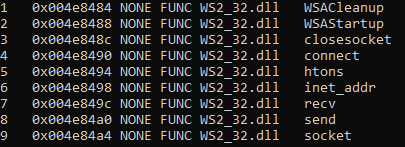
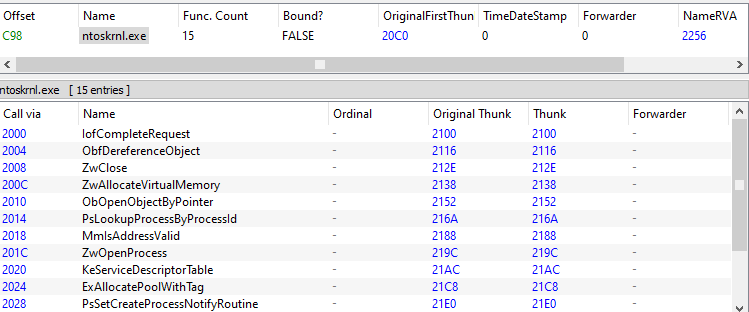
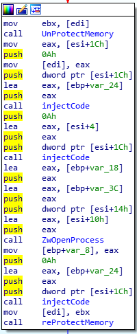

# Informe 

> Sergio Roselló Morell

## Puesta a punto del ordenador con Ubuntu

* Se han actualizado las dependencias y programas instalados en Ubuntu.
* Se ha visto que Ubuntu viene ya con los programas: Wireshark y Tshark
* Se ha descargado y configurado INetSim
* Se descarga apache2 para poder mantener el ordenador Windows permanentemente desconectado de Internet.

## Puesta a punto del ordenador con Windows (Primer análisis)

* Se ha descargado ProcessMonitor
* Se ha descargado PPEE
* Se ha descargado Python, para poder usar Noriben
* Se ha descargado Noriben, para mantener un registro de ProcessMonitor

## Puesta a punto del ordenador con Windows (Segundo análisis)

Se ha descargado e instalado el ejecutable `FLARE-vm` de fireeye

## Transferencia de archivos desde Ubuntu a Windows

Siguiendo las buenas practicas de un entorno de pruebas de malware, el ordenador victima del virus no debe estar conectado a Internet desde que se acaba de configurar (Esto es, instalar los programas necesarios para el análisis y la monitorización del malware)

Para pasar los virus desde el ordenador Ubuntu al Windows, se ha usado el servidor apache2, en el que le creamos un directorio en `/var/www/html/` llamado `malware` para subir los binarios maliciosos.
Desde Windows, y con la interfaz de red de Internet desconectada de Ubuntu, nos conectamos a `192.168.10.10/malware` para descargar el malware. 

## Comandos usados para iniciar apache2 e INetSim

Ambos programas se gestionan desde `systemctl`.
Este programa es un gestor de servicios.
Los servicios son programas, que puede gestionar `systemctl` para iniciar automáticamente al inicio del ordenador.
Para iniciar tanto apache2 como INetSim, el comando que se ha usado es:

> `systemctl start <programa>.service`

En este caso, al ser uno un servidor y otro un simulador del mismo, no pueden ejecutarse a la vez, porque por defecto, usan el mismo puerto.

Esto ha supuesto que se ha tenido que deshabilitar el inicio automático de ambos:

> `systemctl disable <programa>.service`

Para que no salten errores.

En el momento en el que se quería iniciar un análisis del programa malicioso, se deshabilitaba `apache2` para activar `INetSim` Y viceversa cuando se dejaba de analizar el malware.

## Copia del estado de los dos ordenadores

En este momento, se ha hecho una copia de los ordenadores para poder volver al estado original después del análisis.
De esta forma, si nuestro análisis dinámico cambia o rompe nuestro sistema operativo, podemos volver al estado anterior de la ejecución.

Es importante hacer la copia también del ordenador que esta corriendo INetSim, ya que, puede que escape el simulador de alguna forma y nos infecte también este equipo.

De esta manera y manteniendo siempre la red al exterior desconectada, nos podemos asegurar un banco de pruebas correcto.

## Descripciones de las herramientas empleadas:

### Radare2 

Es la herramienta que se ha usado al analizar el ejecutable.
Realiza las mismas funciones que IDA PRO o x64db.
La diferencia mas notoria que tiene es que es basado en linea de comandos.
Esto tiene varias ventajas y desventajas.
Las ventajas son que es ligero, cuando se domina, el análisis se hace mucho mas sencillo, porque tiene la capacidad de ir al grano.
Ademas de hacer análisis estático, también tiene una versión de compilador, esto quiere decir que también se puede usar como herramienta para hacer análisis dinámico.

### INetSim

Es un servicio que permite al analista analizar el malware sin miedo a que el virus se conecte con su servidor CA.
Hace esto porque tiene una serie de respuestas predeterminadas para cada protocolo que soporta.
De esta forma, cuando el malware se intenta conectar con su servidor CA, al pasar por INetSim, este directamente devuelve una respuesta adecuada para cada protocolo.

### Process Monitor con Noriben

Este es un entorno de desarrollo creado alrededor de ProcessMonitor.
Sirve para centrar el estudio del malware en lo realmente importante. 
Hace esto mediante el uso de Whitelists.
Ademas, puede automatizar el proceso de búsqueda de programas maliciosos que por ejemplo, tienen largos periodos de inactividad. 
Hace esto porque registra la actividad de los procesos, de forma que informa aunque el analista no este activamente analizando el malware.

### Process Hacker

Es una herramienta diseñada específicamente para analizar detalladamente el comportamiento de Windows.
Esto quiere decir, que podemos ver todos los programas y procesos que están siendo usados por el sistema operativo en un mismo instante.
La ventaja de esta herramienta es que ademas de ver los procesos, puedes analizar las peticiones red que hace cada proceso, los hilos que tiene el mismo y, en definitiva, desgranar el proceso a todos los niveles.

## Análisis estático con PPEE:

Durante el análisis estático, hemos encontrado varias pruebas que nos hacen pensar que es malware es una shell reversa.
Mas adelante, describimos las pruebas que nos hacen llegar a dicha teoría.

### Cabeceras

Si analizamos las cabeceras con PPEE, vemos que automáticamente detecta que es un ejecutable para la arquitectura de 32 bits.
Ademas, se nos describe el punto de entrada del ejecutable.
En este caso, esta en la dirección virtual `000012D0`.

* En la cabecera *DOS Header* aparecen:
    * Mimbre   Value  Comen
    * *Magic:* `5A4D` MZ

* En la cabecera *Optional Headers* aparecen:
    * *Magic:* `010B` PE32
    * *AddressOfEntryPoint:* 000012D0 .text

Podemos saber que el programa no ha sido comprimido de forma maliciosa porque el `virtualSize` y el `RawSize` son muy similares.

* En la cabecera *Section Headers* aparecen:
    * .text virtual Sise = 0009YAC y RawSize = 0009Eco. Esto quiere decir que no ha usado ningún compresor

Aparecen varios DLL listados como importados por el malware.
Estos son:

* en `DIRECTORY_ENTRY_IMPORTS` aparecen las siguientes API'a
    * `ADVAPI32.DLL` 
    * `KERNEL32.dll` 
    * `msvcrt.dll` 
    * `USER32.dll` 
    * `WS2_32.dll` 

Usando PPEE, las cadenas que nos marca como sospechosas son las siguientes:
Mas adelante, veremos que se han perdido muchas cadenas importantes para el análisis estático del archivo.

* Auspicios Seringa in file:
    * `pwd`

## Análisis estático con radare2:

* Abriendo el binario con radare2:
    * Encontramos una dirección IP en la dirección `0x004A2116`.
    * Analizando las cadenas en .data vemos que hay una dirección IP: `10.10.0.121`
    * Ademas, vemos que hay cadenas que hacen referencia a conexiones.
    * Todo esto nos lleva a pensar que este malware es un reverse shell.
    * Encontramos que hay un switch-case de seis posibilidades.
    * Esto posiblemente sean las distintas opciones del reverse shell

Abrimos el programa, luego, analizamos el binario.
Esto hace que radare2 reconozca las llamadas a funciones y les asigne alias, generalmente basados en su nombre.
Para buscar las cadenas encontradas en la sección `.data`, escribimos el comando `iz`.
Tras analizar las cadenas, nos aparecen todas las que ha podido encontrar.

De la captura previa, casi podemos deducir que estamos ante un reverse shell, pero aun así, no podemos asegurarlo, porque no tenemos pruebas.
Cabe destacar las cadenas:

* `10.0.0.121` 
* `Attempting to connect to` 
* `Connected to` 
* `Waiting for command` 
* `Command received` 
* `whoami\n` 
* `pwd\n` 
* `hostname\n` 
* `disconnect\n` 

De estas cadenas, la única que ha encontrado PPEE conjuntamente con Radare2 es `pwd`

Teniendo esta información, es bastante probable, que este usando funciones de gestión de cadenas para comparar las cadenas que envía el actor malintencionado con las posibles opciones que contiene el programa.

Podemos buscar las llamadas a las funciones que usa el malware con `Radare2` usando el comando: `alf`.
Si analizamos las llamadas a las funciones, vemos que, efectivamente se llama a las siguientes:

Con el comando `s main` le decimos a radare2 que queremos que nos lleve al `main` del binario.
Desde este punto, le decimos que queremos analizarlo: `pdf`.

En la captura anterior vemos que el programa esta autocontenido, ya que todos los saltos son sobre las mismas direcciones.
La única que no devuelve al mismo código es la `0x00410794` que es la salida del programa.
Entiendo que el código lleva a esta dirección cuando el usuario conectado desde Internet envié la cadena `disconnect`.

Sabiendo que el programa parece ser una reverse shell, vamos a analizar las funciones a las que se llaman desde el programa.
Entre otras, encontramos las que hacen referencia a conexiones con sockets.

Esto verifica que efectivamente, se crea una conexión a la IP `10.0.0.121`.

## Análisis Dinámico

Para hacer el análisis dinámico, se usa `x64db`.
Antes de correr el programa con el debugger, nos aseguramos de que la maquina virtual de Ubuntu este desconectada de Internet y que tenga Wireshark y INetSim corriendo.

Al correr el malware directamente con permisos de administrador teniendo Wireshark escuchando en Ubuntu, vemos que, efectivamente, el malware se intenta conectar a la dirección IP `10.0.0.121`.
Lo podemos ver en la siguiente captura de pantalla:

Esto es prueba definitiva que, efectivamente estamos analizando un reverse shell. 

Se ha usado Noriben, de forma que antes de que se inicie el malware, se ejecuta Noriben, que a su vez, ejecuta ProcMon.exe, que es el programa ProcessMonitor.
Este programa registra la actividad de los programas ejecutados después de haberse iniciado, pero por algún motivo, no se ha conseguido hallar un registro del malware en las diversas pruebas que se han llevado a cabo.
Aunque no se ha podido encontrar sacar información valiosa de Noriben, si que hemos podido analizar el malware directamente con ProcessMonitor.

Podemos ver la serie de acciones que ha seguido `maldev.exe` desde el inicio del proceso, cuando se ejecuta con permisos de administrador, hasta que se cierra automáticamente, al no poder conectarse con el servidor CC.

# Conclusiones

Podemos deducir, basándonos en las pruebas obtenidas durante el análisis del malware que es un reverse shell. 
En el momento en el que se ejecuta, crea un hilo y se intenta conectar a su servidor CC.
Al no conseguirlo, porque esta dentro del entorno de pruebas, se cierra al cabo de unos segundos.

# Análisis numero 2

## Cabeceras

Analizando el archivo, podemos ver que estamos delante de un ejecutable para equipos Windows.

La inspección de las cabeceras nos muestra que tan solo se importa un archivo y se usan 15 funciones del mismo;

Tras una búsqueda de la librería `ntoskrnl` vemos que es el archivo binario correspondiente al núcleo o kernel del sistema operativo en la plataforma Microsoft Windows NT.
Es responsable de servicios centrales del sistema, como: la visualización del hardware, el control de procesos, la gestión de memoria, etc. por lo que constituye un módulo fundamental del sistema operativo.

Como vemos en la captura de pantalla anterior, el malware esta llamando directamente a las funciones `Close, AllocateVirtualMemory` y `OpenProcess` con el prefijo `Zw` que, si es llamado por por un kernel-mode driver, indica al la rutina de servicio del sistema a la que llama que la llamada viene de un driver de kernel fiable, por tanto, no valida los parámetros.

Si se llama a las funciones desde una aplicación en user-mode, la rutina revisa los parámetros para asegurar que están bien tratados. 
Ahondando mas, la rutina revisa los buffers proporcionados por el llamador para verificar que están en una sección de memoria valida y correctamente alineados.

* *ZwClose:* Cierra un object handler
* *ZwOpenProcess:* Abre un handler al objeto y establece los permisos de acceso al mismo
* *ZwAllocateVirtualMemory:* Abre un handler al objeto y establece los permisos de acceso al mismo
* *IoCreateDevice:* Crea un device object para que lo use un driver.

## Análisis Estático

Si abrimos el malware con IDA, vemos que detecta varias funciones.
Tras un análisis de lo que hace cada una de ellas, podemos llegar a la siguiente nomenclatura para cada función.

Analizando estas funciones de forma estática llegamos a la siguiente conclusión:

### unProtectMemory

Una forma de anular el control de acceso a una zona de memoria protegida cambiando el registro `cr0`. 

### reProtectMemory

Una forma de habilitar el control de acceso a una zona de memoria protegida cambiando el registro `cr0`.

### injectCode

Esta función copia parámetro 3 veces el contenido del puntero pasado en el parámetro 1 a una nueva dirección de memoria (parámetro 2).
Puesto en contexto, se puede deducir que esta inyectando código a una zona protegida de memoria, a la que no debería estar accediendo.

### exploit

Esta función es la que se encarga de gestionar la lógica de la inyección de código en zona protegida.
Al final, la zona mas interesante de la misma es la parte incluida en la imagen.
Se encarga de des proteger la zona de memoria reservada, inyectar el código en esa zona de memoria y volver a proteger la zona de memoria.

### Routine

Es la rutina que se ejecuta en "start".
Busca el proceso creado en "start" y cede el control a si misma, que luego ejecuta "exploit" al haberlo recibido por el registro `esi`.

### start

Es la entrada del programa.
Crea un device y genera un enlace simbólico para poder buscarlo desde la rutina.
Si esto falla, sale del programa.
Se encarga de configurar todo lo necesario para poder llamar a "exploit" desde la rutina y de añadir la rutina al processNotifier.

## Análisis Dinámico

Al analizar el driver malicioso con x32dbg, se inicia una consola y se cierra automáticamente el proceso.
Esto es debido a que el sample no viene empaquetado en forma de ejecutable, sino un dll.

Para abrirlo, se ha intentado sin éxito utilizar x32dbg.

El primer procedimiento que se ha seguido es el siguiente:

1. Análisis de las funciones a exportar con PEBear (En este punto, no aparece ninguna)
1. Configurar x32dbg para que añada un punto de ruptura al cargar un DLL y en su punto de entrada.
1. Cargar el `.dll` directamente en x32dbg (Porque genera automáticamente un `.exe` el cual podemos analizar.

El segundo procedimiento que se ha seguido es el siguiente:

1. Análisis de las funciones a exportar con PEBear (En este punto, no aparece ninguna)
1. Configurar x32dbg para que añada un punto de ruptura al cargar un DLL y en su punto de entrada.
1. Cargar `runDLL` en x32dbg
1. Cambiar el comando a ejecutar para que importe el `dll`
    * La sintaxis del comando: `rundll32.exe <full path to dll>, <export function> <optional arguments>`
    * Se ha usado la ruta completa en todos los archivos, incluso en el ejecutable de `rundll`
    * Como no se sabia la función que se tenia que usar, porque PEBear no la mostraba, se ha dejado vació, respetando la coma después de la ruta al `dll`
1. El resultado de los comandos mencionados previamente siempre ha sido un error

### Hipótesis de fallo

Sospecho que el malware esta cargando los exporta de forma dinámica al ser ejecutado o que tienen una especie de comprobación de entorno de reversing/debugging. 
Me parece extraño que al analizarlo con PEBear no muestre ningún indicio de ser un `.dll` porque no muestra ninguna función a exportar.

# Comentario del Alumno

Soy consciente que el máximo numero de paginas recomendadas eran menos de 10.
En la primera entrada, es a lo que me he ceñido, pero al darse la situación actual y entrar en el foro y leer que se evaluaría un máximo de dos análisis, he decidido analizar otro malware para poder optar a la máxima nota. 
Espero que se me disculpe la longitud del documento presentado.
He intentado mantener el comentario sobre el análisis del segundo malware no mas breve posible.
Una vez dicho esto, me gustaría mucho entender por que no he podido realizar un análisis dinámico del malware.
Adjunto el enlace al sitio web de donde he descargado el malware por si consideráis oportuno revisarlo.
[https://grsecurity.net/malware_research/](https://grsecurity.net/malware_research/)
Es el archivo llamado: `sample_D__2542ba0e808267f3c35372954ef552fd54859063`.
