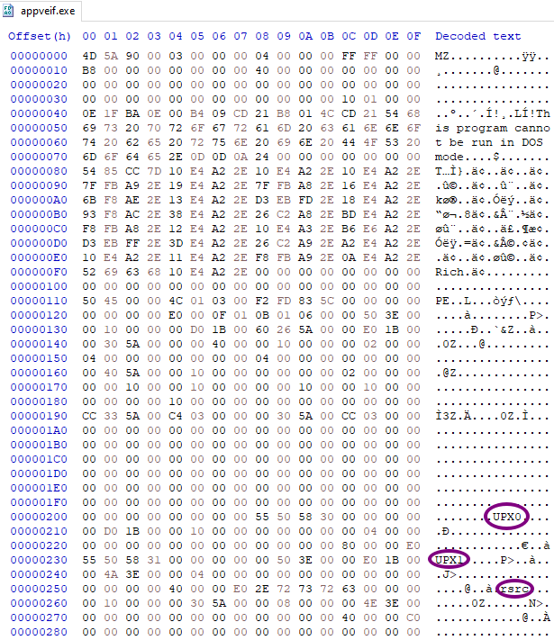
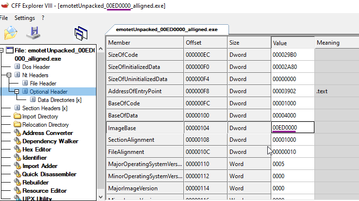

# Ofuscación de malware

## Descripción de las herramientas necesarias para el análisis de malware

### PEstudio
### X64dbg
### Scylla

# Prueba 1 

## Análisis estático de la prueba de malware descargada

Podemos ver en la siguiente captura de pantalla, pruebas de que el malware a analizar ha sido empaquetado por una herramienta bastante conocida llamada UPX

Otro indicativo de que el binario ha sido comprimido es que la diferencia entre el tamaño virtual y el tamaño real es enorme, tanto, que el tamaño real de la parte comprimida es 0.

Vemos ademas, como en las cabeceras opcionales nos dice que el `Address of Entry Point` es en `UPX0`

Todas estas indicaciones nos hacen concluir que se ha comprimido con UPX la sección UPX0, que, una vez ejecutado el malware, se iniciara la rutina de descompresión y se cederá el control a este sección, contenedora del malware, ya descomprimido.

## Análisis dinámico del malware

Levantando la aplicación de Wireshark e INetSim para analizar el comportamiento del malware a nivel de red, vemos que hace una serie de peticiones al servidor DNS para averiguar las direcciones IP de lo que aparentemente, parece que sean los servidores C2.

Podemos ver que algunas de las direcciones que pide son:

* pxi.hognoob.se
* qia.hognoob.se
* uio.hognoob.se
* uio.herohero.info

Al estar usando el INetSim, estas direcciones no se resuelven y el virus no es capaz de contactar con sus servidores C2.

En esta sección, se pretende encontrar alguna de las características estudiadas en el temario del curso. 

* Cifrado Cesar
* Base64
* XOR
* identificación de cryptosignatures

## Análisis desde el punto de vista del empaquetado de ejecutables

En esta sección se pretende desempaquetar el malware seleccionado para posteriormente hacer un volcado de memoria virtual a disco y averiguar las cabeceras
De esta forma, podemos analizar el malware como se ha creado desde el inicio, sin los inconvenientes introducidos por los packers.

### Desempaquetado manual

Se ha decidido usar X64dbg para hacer el desempaquetado manual.
Se inicia el procedimiento, con los programas de análisis dinámico iniciados, para monitoreos el proceso.

El procedimiento es el siguiente:

1. Se descomprime el virus a analizar
1. Se abre ProcessHacker, para poder tener un rastro del proceso
1. Se abre Noriben, para que nos de un resumen de los procesos que hemos mirado con process monitor
1. Se inicia x64dbg con privilegios de administrador
    1. En este momento, esta el virus cargado en memoria
    1. Tenemos que llegar al momento en el que se acaba de descomprimir el malware y se le cede el control
1. Seguimos ejecutando el malware hasta que los avisa de que estamos cediendo el control a una dirección desconocida
1. La siguiente instrucción es el OEP del malware.

### Desempaquetado automático 

# Prueba 2

## Análisis Estático

Con el análisis de las cabeceras, podemos ver que es un ejecutable, porque tiene la cabecera mágica.
Ademas, observando el tamaño del RAW Size de la sección .text y el tamaño del virtual size, vemos que existe una diferencia importante.

## Análisis Dinámico

Al ver que es una muestra que esta packed, podemos ejecutar la muestra con nuestro debugger hasta que se llame al proceso `VirtualAlloc` del API `Kernel32.dll`.

Hacemos esto porque sabemos que el virus es autocontenido y que no crea un nuevo proceso desde si mismo.
Esto quiere decir, que en algún momento, se debe reservar memoria para el virus. 
Esta memoria se reserva con `VirtualAlloc`, pero si nos damos cuenta y entramos en dicha función, vemos que se llama a `KernelBase`.

Para obtener el valor que devuelve la función, debemos poner el breakpoint en el return del código de `KernelBase`.

En este momento, tenemos los siguientes Breakpoints:

Según la documentación de Microsoft, podemos saber que este método devuelve el puntero a memoria en el registro `EAX`, entonces, basta con seguir el registro en el Dump para obtener el programa `Unpacked`.
Tras dos iteraciones, se ha generado un archivo PE en una sección de memoria.

En este momento, sabemos que se ha guardado el archivo unpacked en memoria.
Para llegar a el, tenemos que observar las direcciones de memoria que tienen el bit de ejecutable habilitado.
En este sample en concreto, tenemos dos.
Siguiendo la primera en el dump, podemos ver que esta en esta dirección nuestro PE.
Para extraer el sample unpacked, tenemos que volcar el contenido de la memoria en disco, como en la siguiente imagen:

Una vez tenemos el programa ejecutable en disco, lo volvemos a analizar con un editor PE.

Al abrirlo y analizar la sección `.text` que contiene el código ejecutable, vemos que hace referencia a una sección vacía. 
Esto es debido a que las cabeceras PE están cambiadas para apuntar a las direcciones de las secciones en memoria, no en disco.
Debemos arreglar esto antes de poder abrir el PE con un debugger.
Para hacer esto, lo primero que tenemos que hacer es cambiar las direcciones referenciadas en `RawAddress` por las referenciadas en `VirtualAddress`, de forma que ambos campos tengan los mismos valores.

Lo segundo que tenemos que hacer es cambiar la dirección base de la tabla de cabeceras opcionales para que coincida con la dirección de entrada del programa.

