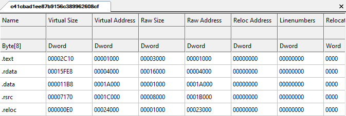
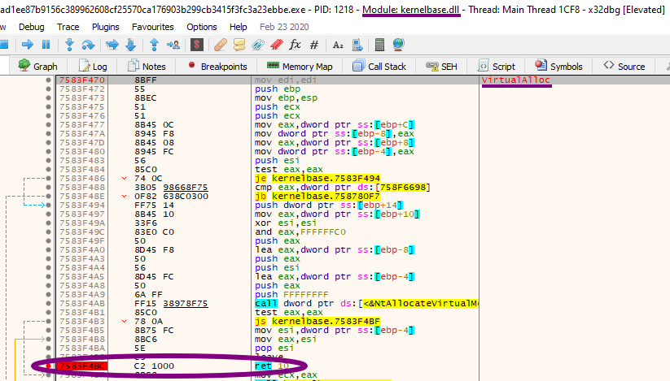
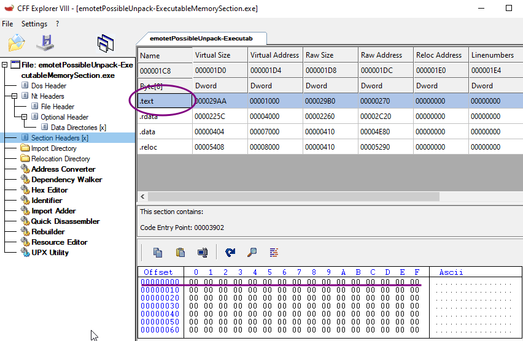

# Ofuscación de malware

## Descripción de las herramientas necesarias para el análisis de malware

### PEBear

Es una herramienta para analizar de forma estática ejecutables para Windows.
Tiene una ventaja sobre los otros programas similares que he probado, y es que es mas visual que el resto.
Ademas, permite editar directamente el archivo.
Esto es importante porque, hay veces, que tenemos que arreglar la tabla PE para poder ejecutar el sample correctamente.

### X64dbg

Como descrito en la practica anterior, es un debugger de ejecutables.
Con este debugger podemos hacer análisis estático y análisis dinámico.
Ademas, se puede editar el archivo, para añadir comentarios, para poder hacer que la practica de reversing sea mas sencilla.
Estos cambios, no se guardan directamente en el binario, sino que se guardan en una base de datos, que al detectar el binario, añade los comentarios, puntos de ruptura y trabajo que hayas realizado con el ejecutable.
Tiene una ventaja sobre IDA, por ejemplo, y es que cuenta con la herramienta Scylla de fabrica.

### Scylla

# Prueba 1 

## Análisis estático de la prueba de malware descargada

Abrimos el malware descargado con PEBear para ver que efectivamente, se trata de un programa para Windows.
Este ejecutable, como la mayoría de malwares, esta compilado para una arquitectura de 32 bits.
De esta forma, tiene mas posibilidades de correr en distintas maquinas.

## Análisis de malware desde el punto de vista de ofuscación

## Análisis desde el punto de vista del empaquetado de ejecutables

En esta sección se pretende desempaquetar el malware seleccionado para posteriormente hacer un volcado de memoria virtual a disco y averiguar las cabeceras
De esta forma, podemos analizar el malware como se ha creado desde el inicio, sin los inconvenientes introducidos por los packers.
 
De primeras, vemos que el ejecutable que estamos analizando no esta packed con ningún malware.
Sabemos que el malware es autocontenido porque el perfil del mismo en VirusShare, vemos que no crea ningún hilo de ejecución.
Esto quiere decir que tenemos que estar atentos a las funciones: `Kernel32::VirtualAlloc()` y `Kernel32::VirtualProtect()`.

Efectivamente, siguiendo la sección de memoria que se copula, vemos que se inserta un archivo PE entero.
Volcando el contenido de memoria a disco, vemos que el malware esta packed.
Ademas, podemos determinar que las cabeceras están sin capear, que es como las espera Windows, por tanto, podemos directamente ir a desempaquetar el malware.
La herramienta que se ha usado para el empaquetado del mismo es UPX, una herramienta muy conocida en el mundo de los packers.

### Desempaquetado automático 

Para hacer el unpack, vamos a usar la misma herramienta que se usa para packear, ya que si se le pasa la opción `-d`, el packer te unpackea cualquier archivo que ha packeado el programa.

En este momento, tenemos el malware unpacked y ya podemos pasar a analizarlo.

### Desempaquetado manual

Se ha decidido usar X64dbg para hacer el desempaquetado manual.
Se inicia el procedimiento, con los programas de análisis dinámico iniciados, para monitoreos el proceso.

El procedimiento es el siguiente:

1. Se descomprime el virus a analizar
1. Se abre ProcessHacker, para poder tener un rastro del proceso
1. Se abre Noriben, para que nos de un resumen de los procesos que hemos mirado con process monitor
1. Se inicia x64dbg con privilegios de administrador
    1. En este momento, esta el virus cargado en memoria
    1. Tenemos que llegar al momento en el que se acaba de descomprimir el malware y se le cede el control
1. Seguimos ejecutando el malware hasta que los avisa de que estamos cediendo el control a una dirección desconocida
1. La siguiente instrucción es el OEP del malware.

# Prueba 2

## Análisis Estático

Con el análisis de las cabeceras, podemos ver que es un ejecutable, porque tiene la cabecera mágica.
Ademas, observando el tamaño del RAW Size de la sección .text y el tamaño del virtual size, vemos que existe una diferencia importante.

## Análisis Dinámico

Al ver que es una muestra que esta packed, podemos ejecutar la muestra con nuestro debugger hasta que se llame al proceso `VirtualAlloc` del API `Kernel32.dll`.

Hacemos esto porque sabemos que el virus es autocontenido y que no crea un nuevo proceso desde si mismo.
Esto quiere decir, que en algún momento, se debe reservar memoria para el virus. 

En este momento, tenemos los siguientes Breakpoints:

Según la documentación de Microsoft, podemos saber que este método devuelve el puntero a memoria en el registro `EAX`, entonces, basta con seguir el registro en el Dump para obtener el programa `Unpacked`.
Tras dos iteraciones, se ha generado un archivo PE en una sección de memoria.

En este momento, sabemos que se ha guardado el archivo unpacked en memoria.
Para llegar a el, tenemos que observar las direcciones de memoria que tienen el bit de ejecutable habilitado.
En este sample en concreto, tenemos dos.
Siguiendo la primera en el dump, podemos ver que esta en esta dirección nuestro PE.
Para extraer el sample unpacked, tenemos que volcar el contenido de la memoria en disco, como en la siguiente imagen:

Una vez tenemos el programa ejecutable en disco, lo volvemos a analizar con un editor PE.

Al abrirlo y analizar la sección `.text` que contiene el código ejecutable, vemos que hace referencia a una sección vacía. 
Esto es debido a que las cabeceras PE están cambiadas para apuntar a las direcciones de las secciones en memoria, no en disco.
Debemos arreglar esto antes de poder abrir el PE con un debugger.
Para hacer esto, lo primero que tenemos que hacer es cambiar las direcciones referenciadas en `RawAddress` por las referenciadas en `VirtualAddress`, de forma que ambos campos tengan los mismos valores.

Lo segundo que tenemos que hacer es cambiar la dirección base de la tabla de cabeceras opcionales para que coincida con la dirección de entrada del programa.

# Ofuscación de malware

## Descripción de las herramientas necesarias para el análisis de malware

### PEBear
