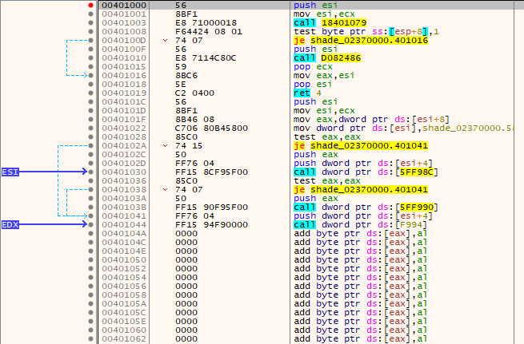
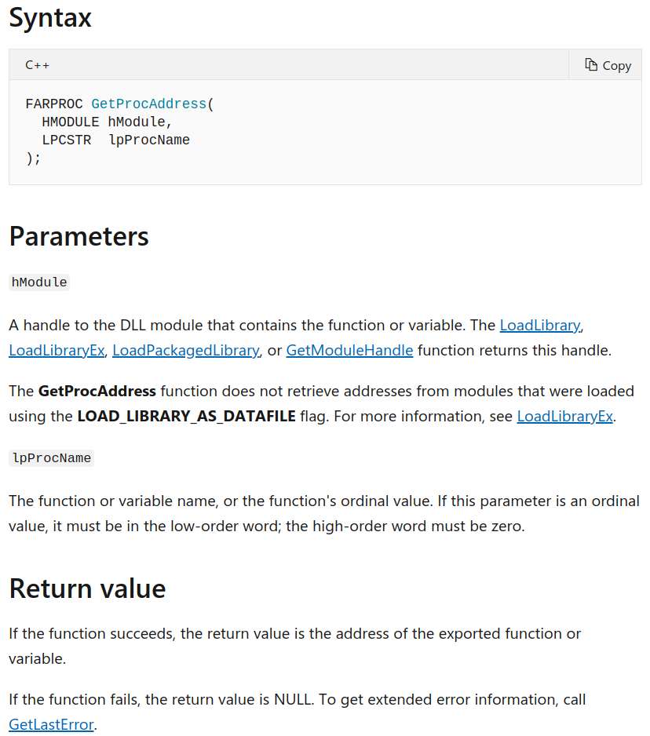
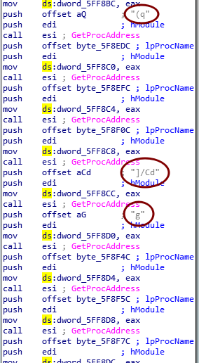
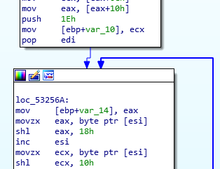
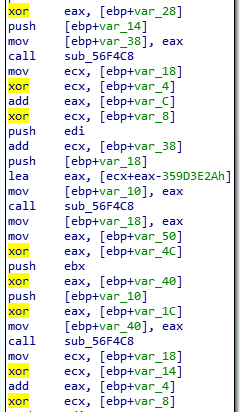
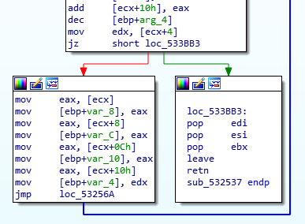
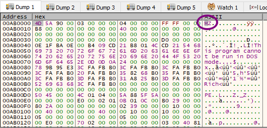
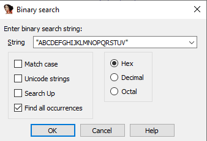
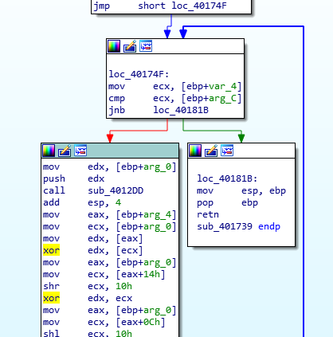

# Ofuscación de malware

## Descripción de las herramientas necesarias para el análisis de malware

### PEBear

Es una herramienta para analizar de forma estática ejecutables para Windows.
Tiene una ventaja sobre los otros programas similares que he probado, y es que es mas visual que el resto.
Ademas, permite editar directamente el archivo.
Esto es importante porque, hay veces, que tenemos que arreglar la tabla PE para poder ejecutar el sample correctamente.

### X64dbg

Como descrito en la practica anterior, es un debugger de ejecutables.
Con este debugger podemos hacer análisis estático y análisis dinámico.
Ademas, se puede editar el archivo, para añadir comentarios, para poder hacer que la practica de reversing sea mas sencilla.
Estos cambios, no se guardan directamente en el binario, sino que se guardan en una base de datos, que al detectar el binario, añade los comentarios, puntos de ruptura y trabajo que hayas realizado con el ejecutable.
Tiene una ventaja sobre IDA, por ejemplo, y es que cuenta con la herramienta Scylla de fabrica.

### Scylla

# Prueba 1 

## Análisis estático de la prueba de malware descargada

Abrimos el malware descargado con PEBear para ver que efectivamente, se trata de un programa para Windows.
Este ejecutable, como la mayoría de malwares, esta compilado para una arquitectura de 32 bits.
De esta forma, tiene mas posibilidades de correr en distintas maquinas.

## Análisis desde el punto de vista del empaquetado de ejecutables (Un binario distinto al inicial)

En esta sección se pretende desempaquetar el malware seleccionado para posteriormente hacer un volcado de memoria virtual a disco y averiguar las cabeceras
De esta forma, podemos analizar el malware como se ha creado desde el inicio, sin los inconvenientes introducidos por los packers.
 
De primeras, vemos que el ejecutable que estamos analizando no esta packed con ningún malware.
Sabemos que el malware es autocontenido porque el perfil del mismo en VirusShare, vemos que no crea ningún hilo de ejecución.
Esto quiere decir que tenemos que estar atentos a las funciones: `Kernel32::VirtualAlloc()` y `Kernel32::VirtualProtect()`.

Efectivamente, siguiendo la sección de memoria que se copula, vemos que se inserta un archivo PE entero.
Volcando el contenido de memoria a disco, vemos que el malware esta packed.
Ademas, podemos determinar que las cabeceras están sin mapear, que es como las espera Windows, por tanto, podemos directamente ir a desempaquetar el malware.
La herramienta que se ha usado para el empaquetado del mismo es UPX, una herramienta muy conocida en el mundo de los packers.

### Desempaquetado automático 

Para hacer el unpack, vamos a usar la misma herramienta que se usa para packear, ya que si se le pasa la opción `-d`, el packer te unpackea cualquier archivo que ha packeado el programa.

En este momento, tenemos el malware unpacked y ya podemos pasar a analizarlo.

### Desempaquetado manual

Se ha decidido usar X64dbg para hacer el desempaquetado manual.
Para poder ejecutar un programa (Malware, en este caso) tiene que estar descomprimido.
Los packers son útiles para evadir el malware de los programas automatizados de control de malware, pero cuando tenemos pruebas de que un malware ha sido packeado, sabemos que vamos a poder extraerlo sin mucho apuro, puesto que en algún momento, este malware va a tener que ser descomprimido y copiado a una sección de memoria, para poder pasarle el control al mismo.
De esta forma, tenemos que buscar en el código del packer, una llamada a una función fuera de la zona de memoria actual.

El procedimiento es el siguiente:

1. Poner un punto de ruptura de acceso en la zona UPX0
    * Esto lo hacemos porque cuando se ceda el control a esta zona de memoria, ya estará el malware descomprimido.
    * En el caso en el que se nos escape la llamada a la zona de memoria, este punto de ruptura evitara que el malware se ejecute en nuestro sistema.
1. Analizar el código hasta que se entrega el control a la zona de memoria fuera de la sección UPX1, que es la del código "Stub".
1. Poner el brakepoint justo antes de esa llamada y sacar el binario de la zona de memoria ya populada con el malware descomprimido.
1. Si el malware, no tiene las cabeceras, usar Scylla para arreglar la tabla de Imports y volcar la zona a disco como un PE "Standalone"

Si entramos a revisar el contenido de la zona de memoria asignada a UPX0, vemos que no hay nada escrito en esta zona de memoria.
Esto puede ser un indicativo de que cuando el código acabe de descombrar el malware, este sera guardado en esta zona.

Si observamos la siguiente foto, podemos ver como ahora, la zona de memoria que estaba completamente vacía, esta siendo populada con código.

Llegados a este punto, sabemos también que al ser una aplicación de consola, Windows va a llamar a la función `GetCommandLineA` así que le asignamos un breakpoint a esta también.

Corremos el código hasta que encontramos que se le llama, seguimos el trazo hasta que devuelve.
Un poco mas abajo, vemos una llamada que hace referencia a la dirección de memoria que se ejecuta con el malware descomprimido.
Se puede ver en la siguiente foto.

En este momento, tenemos el OEP.
Ejecutamos hasta que llegamos al primer breakpoint, hacemos un `step into` y abrimos la dirección la dirección a la que apunta nuestro `eip` con Scylla.

Hacemos un dump de memoria para luego abrirlo y hacer un PE rebuild.
Esto sirve para reconstruir la table PE.
Sin esto, no podemos abrir el ejecutable de forma independiente.

## Análisis de malware desde el punto de vista de ofuscación

Una vez tenemos el Malware desempaquetado, podemos ver que hace dos llamadas en las primeras lineas de código a una dirección de memoria, sin nada asignado. 
Esto, en nuestro caso significa que el malware construye su IAT de forma dinámica.
Para poder analizar el código bien, tenemos que averiguar que función carga las librerías de forma dinámica.

Al seguir el flujo, vemos que los nombres de las librerías que se cargan están cifrados.
Esto lo sabemos porque esta usando la función `GetProcAddress` y si miramos en la documentación de Microsoft, vemos que se le tiene que pasar el nombre de la función o variable.

Vamos a proceder a descifrar los nombres.
Para hacer esto, lo mas sencillo es encontrar la función que descifra los nombres y dejar que se ejecute en un análisis dinámico.
Esto nos dejaría con todos los nombres de los métodos importados resueltos.

No se ha averiguado el tipo de cifrado que ha sido implementado en el malware.

### Búsqueda de cifrado Cesar

En el malware, no se ha encontrado ninguna cadena que haga referencia al cifrado Cesar.

### Búsqueda de cifrado Base64

Se han buscado las cadenas que posiblemente puedan contener la clave del cifrado Base64, pero tampoco se ha encontrado nada.
El patrón que se ha buscado es el siguiente:

> `ABCDEFGHIJK`

Al ser una parte de la cadena, si se encuentra esta cadena, seguramente encontremos la clave del cifrado Base64.
Tampoco se ha encontrado ninguna ocurrencia de la cadena.

### Búsqueda de cifrado XOR

Para encontrar las funciones de cifrado XOR hemos buscado con IDA `XOR` en el buscador.
Esto nos ha sacado muchas instrucciones (14839), pero solo 18 funciones han resultado tener XOR que no comparen el mismo registro.
Se ha empezado a analizar la función `sub_532537` y se ha encontrado una estructura que tiene un símil muy cercano al de una función `xor` sencilla.

Analizando el malware para buscar funciones con la esta

# Prueba 2

## Análisis Estático

Con el análisis de las cabeceras, podemos ver que es un ejecutable, porque tiene la cabecera mágica.
Ademas, observando el tamaño del RAW Size de la sección .text y el tamaño del virtual size, vemos que existe una diferencia importante.

## Análisis Dinámico

Al ver que es una muestra que esta packed, podemos ejecutar la muestra con nuestro debugger hasta que se llame al proceso `VirtualAlloc` del API `Kernel32.dll`.

Hacemos esto porque sabemos que el virus es autocontenido y que no crea un nuevo proceso desde si mismo.
Esto quiere decir, que en algún momento, se debe reservar memoria para el virus. 

En este momento, tenemos los siguientes Breakpoints:

Según la documentación de Microsoft, podemos saber que este método devuelve el puntero a memoria en el registro `EAX`, entonces, basta con seguir el registro en el Dump para obtener el programa `Unpacked`.
Tras dos iteraciones, se ha generado un archivo PE en una sección de memoria.

En este momento, sabemos que se ha guardado el archivo unpacked en memoria.
Para llegar a el, tenemos que observar las direcciones de memoria que tienen el bit de ejecutable habilitado.
En este sample en concreto, tenemos dos.
Siguiendo la primera en el dump, podemos ver que esta en esta dirección nuestro PE.
Para extraer el sample unpacked, tenemos que volcar el contenido de la memoria en disco, como en la siguiente imagen:

Una vez tenemos el programa ejecutable en disco, lo volvemos a analizar con un editor PE.

Al abrirlo y analizar la sección `.text` que contiene el código ejecutable, vemos que hace referencia a una sección vacía. 
Esto es debido a que las cabeceras PE están cambiadas para apuntar a las direcciones de las secciones en memoria, no en disco.
Debemos arreglar esto antes de poder abrir el PE con un debugger.
Para hacer esto, lo primero que tenemos que hacer es cambiar las direcciones referenciadas en `RawAddress` por las referenciadas en `VirtualAddress`, de forma que ambos campos tengan los mismos valores.

Lo segundo que tenemos que hacer es cambiar la dirección base de la tabla de cabeceras opcionales para que coincida con la dirección de entrada del programa.

Una vez hecho esto, podemos abrir el malware para analizar el código malicioso sin distracciones.

## Análisis de malware desde el punto de vista de ofuscación (Con un malware distinto)

### Búsqueda de cifrado Cesar

En el siguiente malware, vamos a buscar indicios de que existe una implementación de cifrado Cesar

Se han buscado las cadenas del archivo y no se reconoce ninguna cadena potencialmente similar a la que sacaría un cifrado Cesar.
Esto quiere decir que no es muy probable que se use un cifrado cesar en este malware.

### Búsqueda de cifrado Base64

Para averiguar si se usa Base64, vamos a buscar en todas las cadenas del malware una que contenga todos los caracteres que se usan para cifrar con Base64.
Es cierto, que a veces, los autores de malware, usan una cadena que han decidido ellos, pero la idea de que esta tiene que contener todos los valores posibles, persiste.

Buscando en este malware la cadena que contiene los valores posibles Base64 o la cadena parcial, pero no se encuentra.

### Búsqueda de cifrado XOR

Iniciamos la búsqueda de cadenas ofuscadas.
Empezamos con la técnica de ofuscación XOR.
Buscando por Seringa en IDA, vemos bastantes resultados con XOR, unos 112, para ser exactos, pero de estos, los que nos interesan, son solo unos 11.
Todos estos están en la misma función, que parece que sea una función de cifrado XOR.
Los `XOR` que nos interesan son los que no realizan la misma operación sobre el registro, ya que esto, en un XOR siempre devuelve 0.

## Descripción de las herramientas necesarias para el análisis de malware

### PEBear
